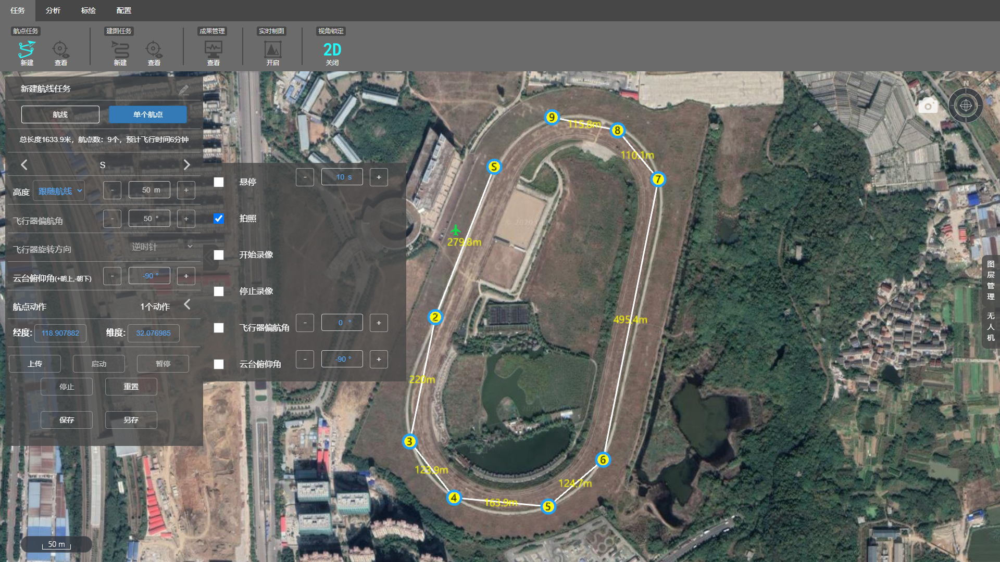
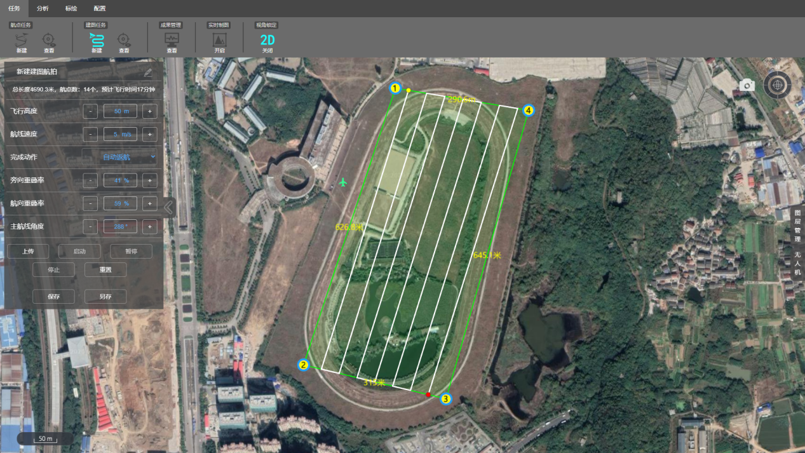
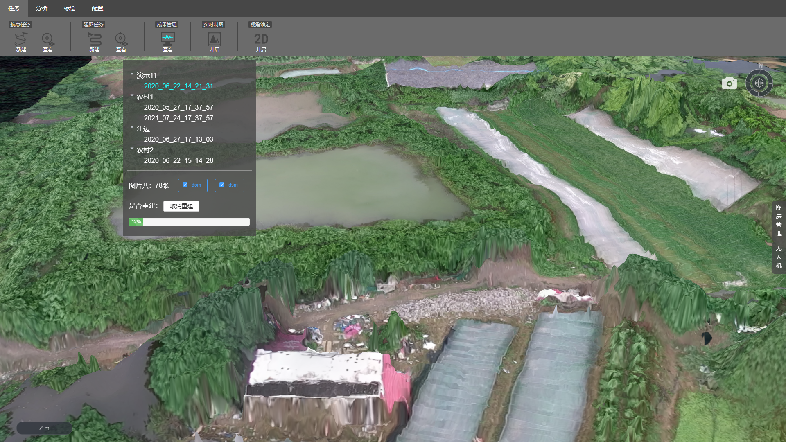
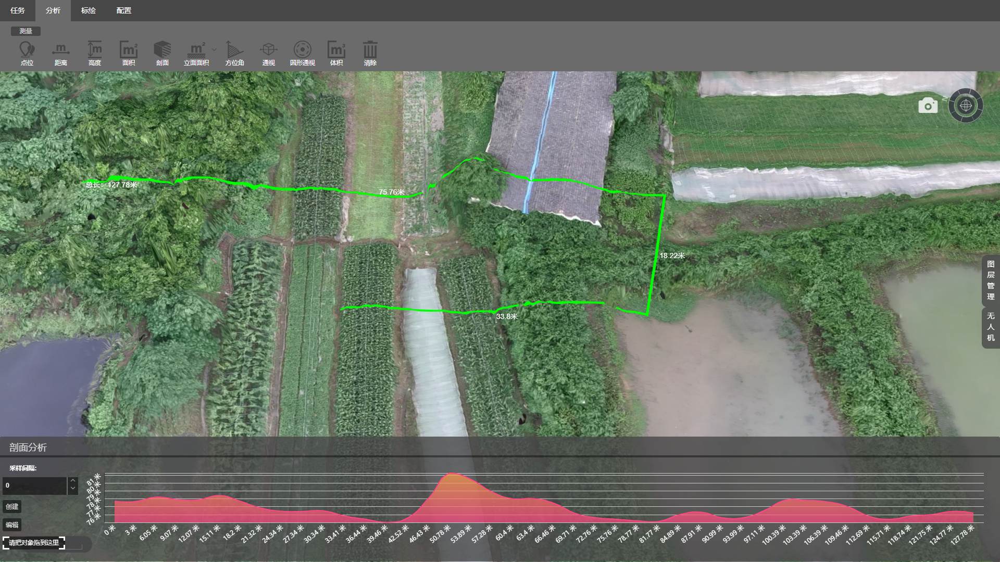
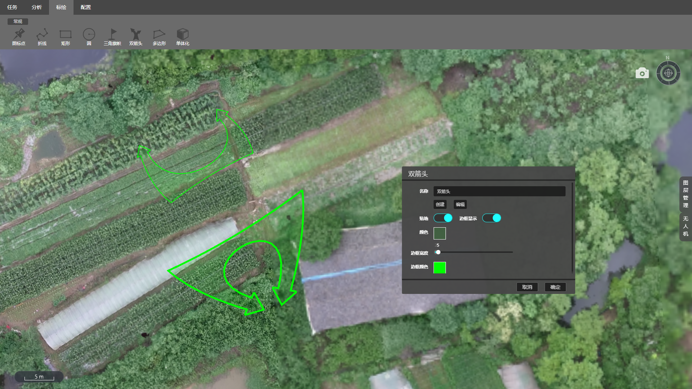
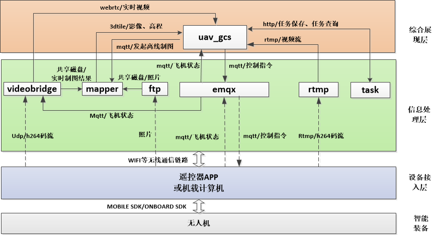

# 效果展示
整体界面

任务规划

航线执行监控

三维重建

地形分析

地图标绘

# 主要功能
* 二三维一体无人机态势监控
* 航线规划、飞行控制、实时视频、实时制图、离线三维重建、基于地图的标绘分析高度集成一体
* 无人机接入协议开源
* 基于MOBILE SDK的大疆M210 M300无人机机接入APP 开源
* 基于ONBOARD SDK的大疆M210 无人机接入服务 开源

# 系统架构

如上图所示，系统划分为四层，依次为“智能化装备”、“设备接入层”、“信息处理层”、“综合展现层”。
* 智能化装备：包括无人机、无人车、无人船等
* 设备接入层：利用智能化装备提供的SDK，获取设备状态、控制设备运行，并通过无线通信手段将数据转发给信息处理层
* 信息处理层：提供视频分发、图像拼接、三维重建、地图瓦片、消息分发等能力。对设备接入层的信息进行组织加工
* 综合展现层：提供二三维态势监控、视频监控、任务规划、地图标绘、飞行状态监控等功能

## 综合展现层
    综合展现层基于cesium开发，支持二三维地图。详细说明参见 [https://github.com/jiushuokj/uav_gcs]

## 信息处理层
    以docker容器的形式提供了以下几个服务，参见 [https://github.com/jiushuokj/uav_gcs] ：
  *  emqx: 作为系统的消息总线，提供订阅分发能力。
  *  ftp: 当无人机降落后，设备接入层将采集的照片自动上传到ftp服务器
  *  mapper: 
    *  提供3d tile格式的影像、高程服务，为综合展现层cesium提供GIS数据
    *  基于OPENDRONEMAP，提供对ftp中照片的三维重建能力
  * rtmp: 提供rtmp视频分发服务，接收设备接入层推送的rtmp视频流并推送到综合展现层
  * videobridge: 
    * 通过udp方式接收设备接入层发送的H264原始码流，并转码为webrtc码流
    * 通过webrtc方式将码流推送給各用户
    * 基于视频和无人机位置提供实时制图功能，实时制图生成的瓦片数据提供给Mapper

## 设备接入层
    设备接入层支持两种接入方式：
  * 遥控器转发接入[https://github.com/jiushuokj/uav_mobile_app]
    * 以大疆M210和M300为例，基于MOBILE SDK，开发转发APP，将飞机状态通过MQTT上报信息处理层；将采集的照片上传FTP服务器；将视频流通过UDP或者RTMP方式上报信息处理层。
    * 接收信息处理层或综合展现层下达的控制命令、航线命令，并控制飞机完成相应的动作
  * 机载计算机接入
    * 以大疆M210为例，基于ONBOARD SDK,开发机载计算机程序，将飞机状态通过MQTT上报信息处理层；将采集的照片上传FTP服务器；将视频流通过webrtc方式上报信息处理层。
    * 接收信息处理层或综合展现层下达的控制命令、航线命令，并控制飞机完成相应的动作

## 设备层
   目前适配过大疆M210 M300。
   
# 协议
    https://github.com/jiushuokj/uav_protocol

